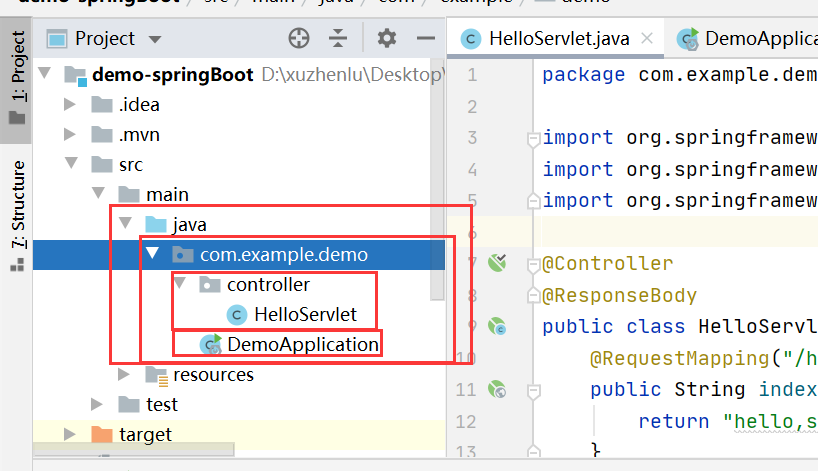

# 项目结构

# HelloServlet下的代码
```java
package com.example.demo.controller;

import org.springframework.stereotype.Controller;
import org.springframework.web.bind.annotation.RequestMapping;
import org.springframework.web.bind.annotation.ResponseBody;

@Controller//告诉spring这是个controller
@ResponseBody
public class HelloServlet {
    @RequestMapping("/hello")
    public String index(){
        return "hello,spring";
    }
}

```